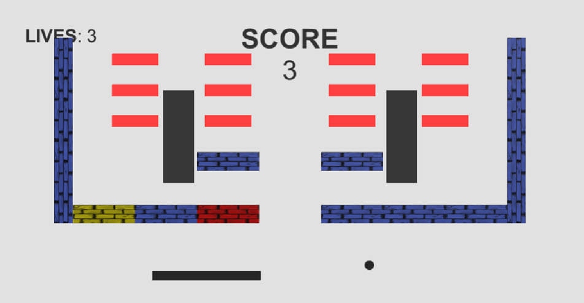

# Ознайомлювальний проект для набуття перших навичок роботи з Unity 3D

## The very first work in Unity 3D to get acquainted with the Unity game engine

# Block Breaker 2D

Used Template: https://assetstore.unity.com/packages/templates/packs/block-breaker-template-63173

Розробка гри проводилась у операційній системі Windows 10. Було обрано Template Pack під назвою «Block Breaker
Template». Для того, щоб створити нові рівні було додано новий контент.
На початку шаблон ігри містив тільки три основні сутності: шар (`ball`), платформу (`paddle`) та блоки (`blocks`).


Було додано наступний контент:

* Стіни (`walls`), що можуть обертатися
* Перешкоди (`obstacles`), які можна зламати
* Бонуси (`bonuses`), що випадають із зламаних перешкод

### Стіни (`walls`)

**Стіни** є простим двовимірним прямокутником, що має свій `Box Collider`, який є тригером. Їхня суть у тому, щоб
перешкоджати рух шару та відбивати його.


На початку створення стіни вона додає себе до списку всіх стін, що міститься в ігровому менеджері. Також можна
встановити флаг `rotating` у положення «true», щоб стіна **оберталася** із центром у перетині діагоналей.

### Перешкоди (`obstacles`)

Перешкоди, що можна зламати – це по суті розширення функціоналу звичайних стін, але без можливості обертатися. Для їх
створення було завантажено asset під назвою «Ouroboros», що містить наступні матеріали:


Для розробки перешкоди було використано останній матеріал з малюнку, який є стіною з цегли.


На відміну від стіни було використано сітку (`mesh`) для створення цього об'єкту. Перешкода також має `Box Collider` для
відстежування перетину з шаром.

При створенні об'єкту, він додає себе до списку всіх перешкод, що містить ігровий менеджер. Також ми створюємо список із
двох елементів, що містить жовтий та червоний кольори. Ідея в тому, щоб перешкоду можна було розбити за 3 удари, а з
кожним ударом перешкода повинна змінити свій колір. Спочатку перешкода синього кольору, що є символом міцності, потім
жовтого кольору, що показує, що перешкода пошкоджена та красний колір показує, що перешкода буде знищена наступним
ударом.



Для перешкоди була додана можливість з'являтися з затримкою за наступним законом розподілу ймовірностей:

| Time range <br/>(seconds) | Probability |
|---------------------------|-------------|
| 0 - 30                    | 0.05        |
| 30 - 60                   | 0.45        |
| 60 - 90                   | 0.30        | 
| 90 - 120                  | 0.15        | 
| 120 - 150                 | 0.05        | 

За це відповідає характеристика під назвою `spawnDelay`. Щоб активувати затримку для перешкоди, встановіть значення в
положення "true"

### Бонуси (`bonuses`)

Зі зруйнованих перешкод можуть випадати **бонуси**, які допоможуть гравцю легше пройти рівень. Було додано два бонуси:
«Extension Bonus» та «Clone Bonus». Для створення бонусів було використано asset під назвою «Homeless», який містить
іконки, що були використані для зображення бонусів:


**Extension Bonus** розширяє основну платформу гравця на 10 секунд. Якщо гравець зловить
кілька таких бонусів, то довжина платформи буде збільшуватися все більше, але тільки на 10 секунд.


**Clone Bonus** клонує всі шари, що зараз є в грі. Тобто якщо в нас був один шар, стане 2, якщо було 2 стане 4, якщо
було 3 стане 6 і т.д. Коли відбувається клонування, новий шар з'являється на тому ж місці й рухається тим же напрямком,
але з невеликою затримкою при старті, щоб можна було побачити обидва – оригінал та клон.


Але для того, щоб реалізувати Clone Bonus потрібно було **змінити основний алгоритм** гри. Адже шаблон встановлює, що
при падінні шару ми втрачаємо життя, а нам потрібно, щоб життя втрачалося тільки при падінні **всіх** шарів.
Для цього в ігровому менеджері була додана колекція шарів та логіка по їх створенню.

Бонуси мають `Box Collider`, щоб можна було визначити, що вони перетинають основну платформу гравця, а також було додано
`Rigid Body` для того, щоб бонуси падали вниз і гравець міг їх впіймати, або пропустити.

### Levels

Було створено 3 рівні Battle pass, на кожному з яких демонструється новий функціональний контент. Для цього було
додано меню рівнів, щоб гравець міг обрати з якого рівня почату гру:


**Перший рівень** містить стіни, що обертаються:


**Другий рівень** містить перешкоди, які можна зруйнувати, але з яких не випадають бонуси:


**Третій рівень** містить стіни та перешкоди, але вже з бонусами. Вибір бонуса, що має випасти, є випадковим:


## Генерація рівнів

Для генерації нових рівнів було використано сцену під назвою "Game", яка йшла як демо для шаблону гри.
Для початку треба було визначити межі нашої сцени, щоб не генерувати об'єкти поза межами сцени, куди шару не дістатись.
Для цього було додано 4 параметри до `GameManager`:

* `leftSpawnBorder`
* `rightSpawnBorder`
* `topSpawnBorder`
* `bottomSpawnBorder`


Основна платформа та шар завжди генеруються в одному місці, але весь інший контент буде генеруватися від верхнього
лівого кута до правого нижнього кута в межах, що ми визначили.

Треба враховувати також, що ми не завжди хочемо генерувати рівень, частіше всього ми будуємо рівень самі, як для Battle
pass, наприклад. Тому було додано ще одну змінну до `GameManager` під назвою `generateEntitiesRandomly`.

Останній момент – це те, що ми не хочемо, щоб було надто багато стін, адже шар не може їх знищити, тому було додано
змінну `wallsCountToGenerate` для встановлення максимальної кількості згенерованих стін.

Спочатку йде перевірка, що значення `generateEntitiesRandomly` є "true", тобто користувач хоче згенерувати контент. Далі
створюємо наступні змінні:

````
bool canAddMoreEntities = true;
int leftBorder = leftSpawnBorder;
int topBorder = topSpawnBorder;
int wallsCount = 0;
int colorId = 0;
````

Перша змінна відповідає за припинення генерації, тобто коли вже немає місця для нового контенту. Наступні дві змінні –
копії лівої та верхньої меж, `wallsCount` – це лічильник вже згенерованих стін, а `colorId` – індекс кольору для блоку
на поточному рядку.

Далі ми випадковим образом обираємо, що згенерувати:

````
int randomChoice = Random.Range(1, 4);
````

Генерується число від 1 до 3, де:
 * 1 – згенерувати блок
 * 2 – згенерувати перешкоду
 * 3 – згенерувати стіну

При генерації стін йде перевірка, що ми ще не згенерували максимально доступну кількість, вказану користувачем:

````
case 3:
if (wallsCount < wallsCountToGenerate)
````

Коли ми вже згенерували об’єкт, ми зберігаємо його розміри в змінну `sizesOfNewObject`:

````
sizesOfNewObject = new Vector3(obstacle.transform.localScale.x, obstacle.transform.localScale.y, 0);
````

Приклад генерації контенту, наприклад стіни:

````
case 3:
if (wallsCount < wallsCountToGenerate)
{
     Vector3 wallPos = new Vector3(leftBorder, topBorder, 0);
     GameObject wall = Instantiate(wallPrefab, wallPos, Quaternion.identity) as GameObject;
         
     wall.GetComponent<Wall>().manager = this;
     wall.GetComponent<Wall>().rotating = Random.Range(0, 2) == 1;
         
     sizesOfNewObject = new Vector3(wall.transform.localScale.x / 100, wall.transform.localScale.y / 100, 0);
     wallsCount++;
}
break;
````

Як бачите, випадковим чином також обирається, чи буде стіна обертатись довкола, чи не буде ворушитись. Найголовніший
момент – це вираховування позиції, де потрібно згенерувати новий об’єкт:

````
Vector3 newObjectPosition = new Vector3(leftBorder, topBorder, 0);
````

Готово! Ми згенерували об’єкт та зберегли його розмір в окрему змінну `sizesOfNewObject`. Тепер нам потрібно зменшити
доступну область для генерації нових об'єктів, адже частину ми вже зайняли тільки що згенерованим об'єктом.
На початку ми скопіювали змінні лівої та верхньої межі в окремі змінні. Використовуючи їх, додаємо до лівої межі
довжину об'єкта (ось Х), що ми щойно згенерували + 1 (для проміжків):

````
leftBorder += (int)sizesOfNewObject.x + 1;
````

Ось для чого ми зберігали розміри нового об'єкту - щоб здвинути ліву межу праворуч, тобто місця стає менше.
Далі нам потрібно перевірити, що наша ліва межа не дійшла ще до правої, щоб нам не вилізти за праву межу.

````
if (leftBorder >= rightSpawnBorder)
````

Якщо ми вже дійшли до правої межі, нам потрібно перейти на наступний рядок, тобто спуститись униз по осі Y. Коли ми
спускаємось на наступний рядок, ми знову починаємо йти з початку лівої межі.

````
if (leftBorder >= rightSpawnBorder)
{
    leftBorder = leftSpawnBorder;
    topBorder -= (int)wallPrefab.transform.localScale.y / 100;
    colorId++;

    if (colorId == colors.Length) colorId = 0;
}
````

Також, для наступного рядка ми використовуємо наступний колір для нових блоків. Нарешті визначимо, коли ми вже повністю 
заповнили доступний для контенту простір. Для цього, після переходу на новий рядок, ми перевіряємо, що координати нового 
рядка не нижче нижньої межі. Якщо нижче чи дорівнює нижній межі – ми заповнили весь доступний простір:

````
if (topBorder <= bottomSpawnBorder)
{
    canAddMoreEntities = false;
}
````

Таким чином ми завершуємо генерацію контенту. Далі представлені результати випадкової генерації контенту:


### P.S
Для прискорення часу утримуйте клавішу `W`.